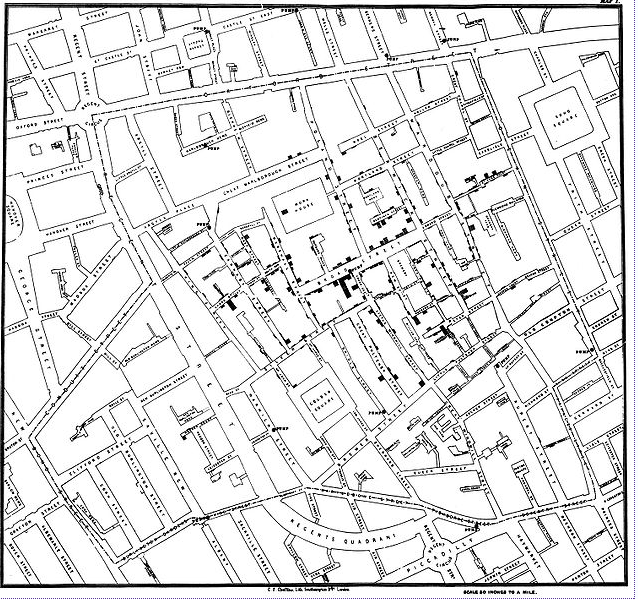
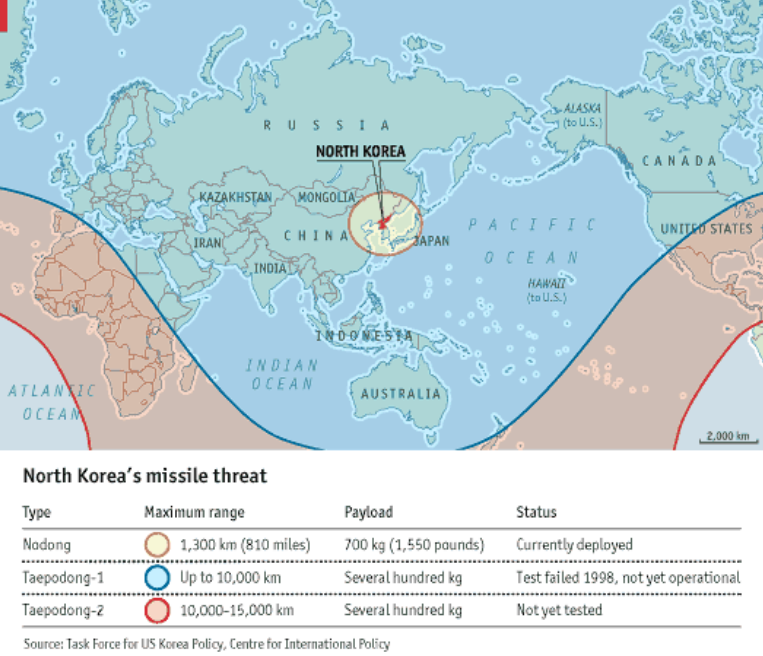
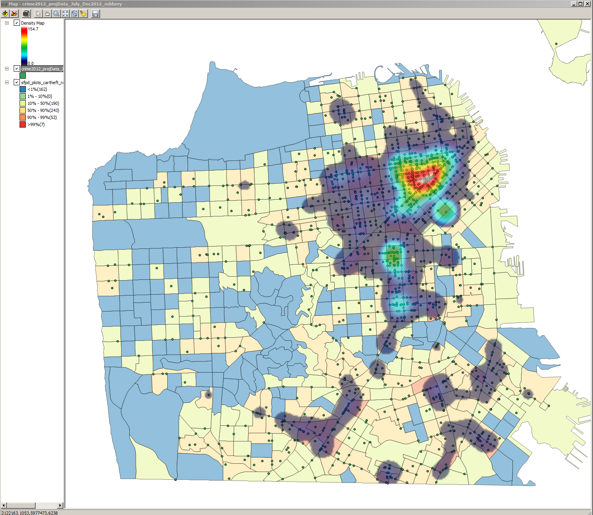
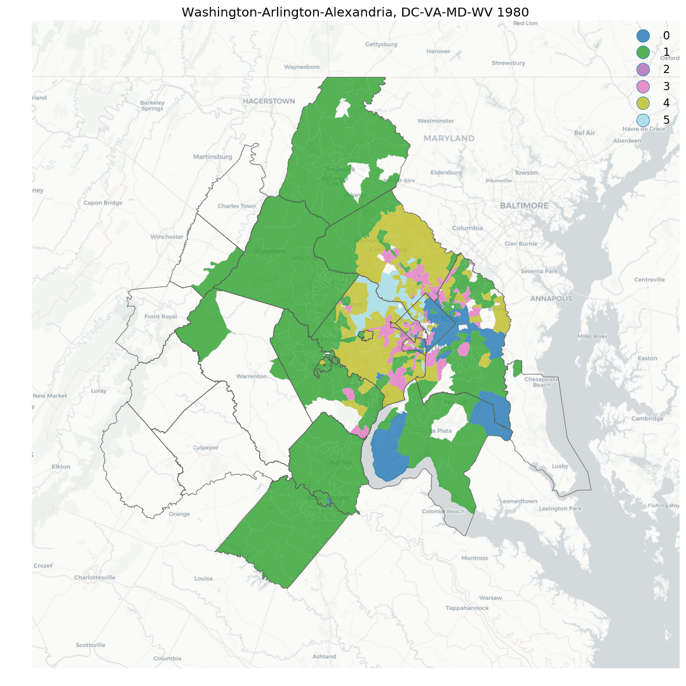
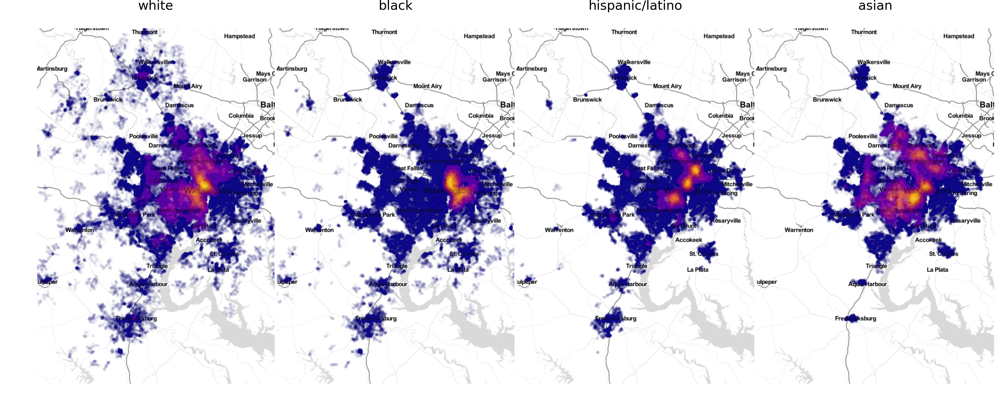
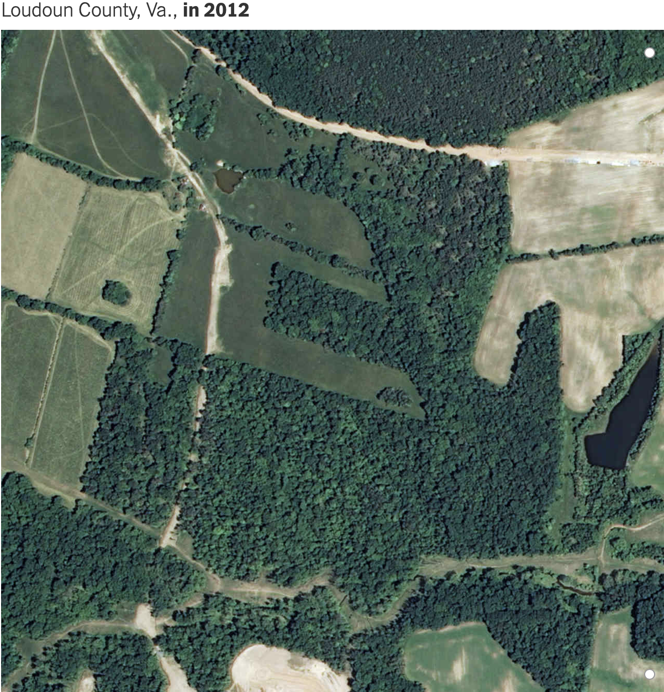
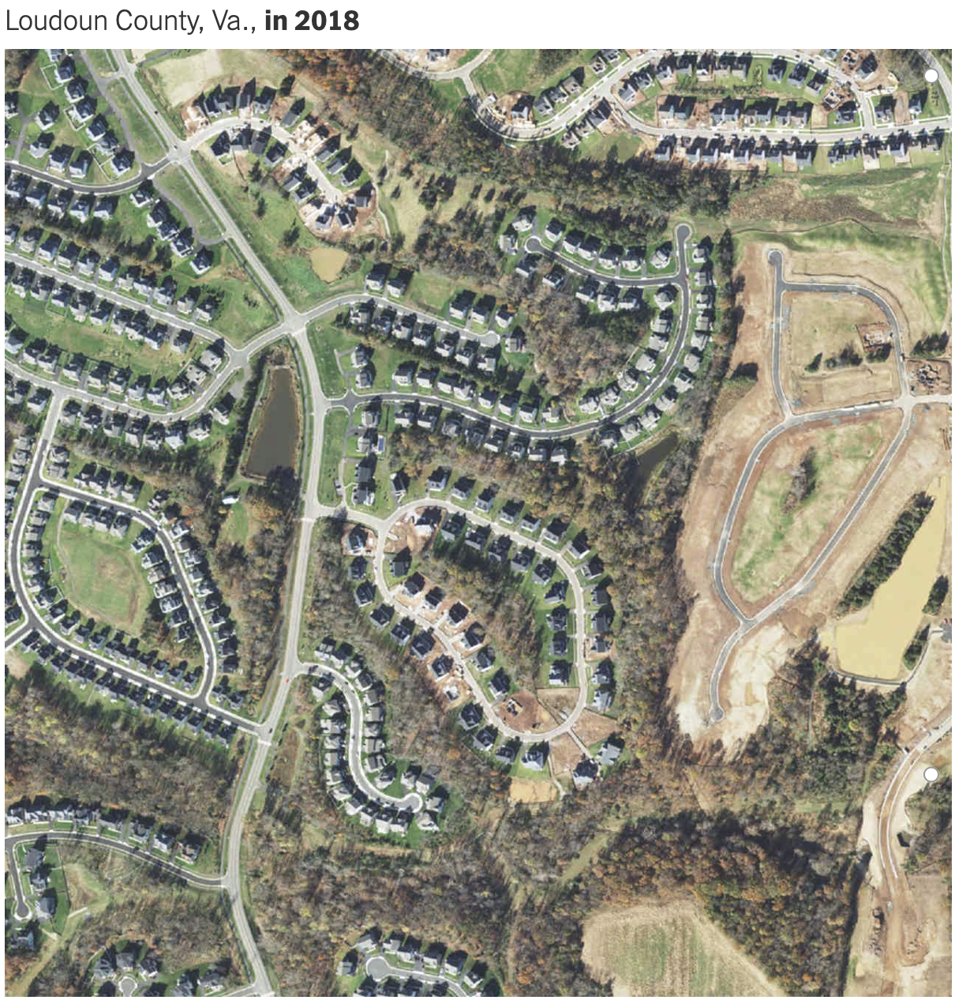
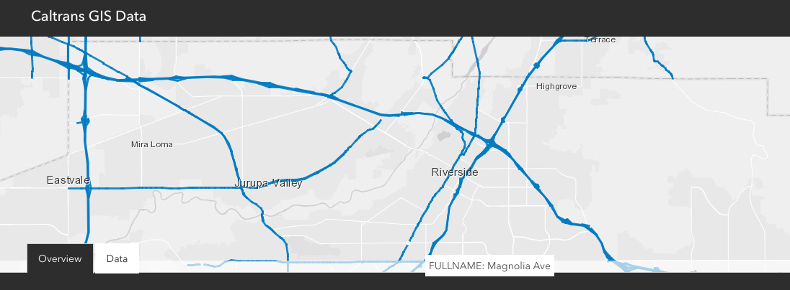
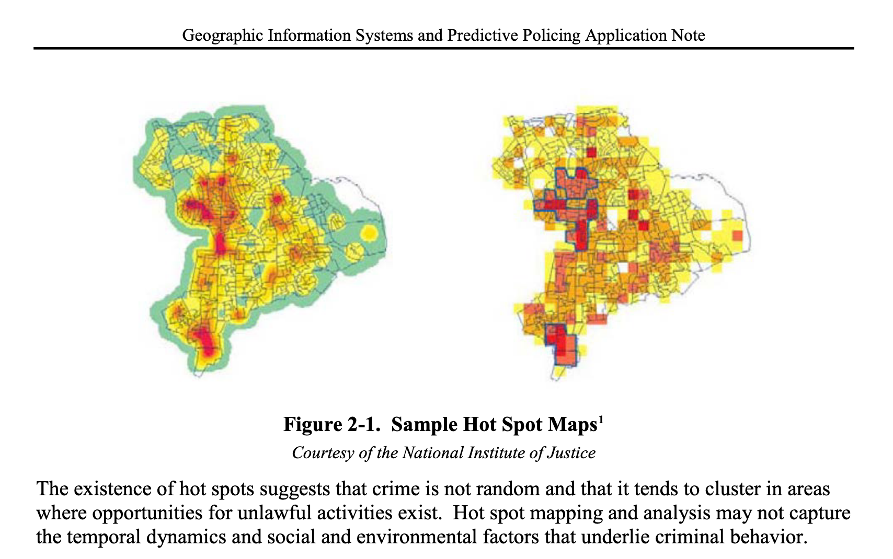

# Introduction to GIS
## Overview
In this lecture we provide the context for GIS in public policy. The objectives are:
- Introduce the concept of spatial thinking
- Define GIS
- Provide an overview of motivations for and applications of GIS in public policy

## Spatial Thinking

The focus of this course is on developing:
- spatial *thinking*
- spatial *skills*

### Origins


```{admonition} Earliest human writing
5,500 BP
```

### Early Spatial Analysis



### Modern (lack of) Spatial Thinking


### Modern Spatial Thinking




## GIS
The acronym GIS can take on multiple meanings:

- Geographic Information *Systems* or GISystems
- Geographic Information *Services* or GIServices
- Geographic Information *Science* or GIScience
### Geographic Information Systems 
- *Geographic*: refers to a specific on or in relation to the Earth's surface
- *Information*: data to which some value or interpretation has been added
- *Systems*: a system designed to perform a wide range of function on and with GI 

### Geographic Information Services
- Provision of services
- Location based services
- Private and Government

<iframe class='fragment' width="560" height="315" src="https://rcitgis-countyofriverside.hub.arcgis.com" frameborder="0" allowfullscreen> </iframe>


###  Geographic Information Science

- The *science* behind GISystems
- Coined by [Michael Goodchild]() in 1992
- Acronym: **GISCIENCE**


<iframe class='fragment' width="560" height="315" src="https://www.youtube.com/embed/tbZ_QB6wuZs" frameborder="0" allow="accelerometer; autoplay; encrypted-media; gyroscope; picture-in-picture" allowfullscreen></iframe>


## GIS and Public Policy

### Why GIS and Public Policy?

- Everything we do takes place at some time and *some place*
- Spatial *context* matters
- Policy implementation should consider geographical dimensions
- Policy evaluation (analysis) from a spatial perspective

### Positive Applications of GIS in Public Policy

- Using GIS to do policy analysis
- GIS derived measures
- Spatial externalities and spillovers
- Monitoring


Using GIS to *describe the world*

#### GIS based policy analysis

##### Environmental Disparities and Equity Analysis


##### Spatial Criminology



##### Neighborhood Change


[source](https://github.com/spatialucr/geosnap)

##### Segregation


[source](https://github.com/pysal/segregation)
#### GIS derived measures 

##### Food Deserts


##### Accessibility to Parks

[Source](https://www.azavea.com/blog/2014/09/04/creating-a-cost-distance-surface-to-measure-park-access/)


#### Detecting Land Use Change





###  Normative Applications of GIS
- *Prescriptive*
- Using GIS to *change the world*

#### School Redistricting


[source](http://riversideunified.org/departments/operations_division/planning___development/district_boundary_maps)

#### Transportation Planning

[source](https://gisdata-caltrans.opendata.arcgis.com/datasets/8887c21dce1d45ad93cd78a10b24781b_0?geometry=-117.709%2C33.942%2C-117.056%2C34.042)

#### Geographical Targeting

[source](https://www.dhs.gov/sites/default/files/publications/GIS-Predictive-Policing-AppN_0813-508_0.pdf)

