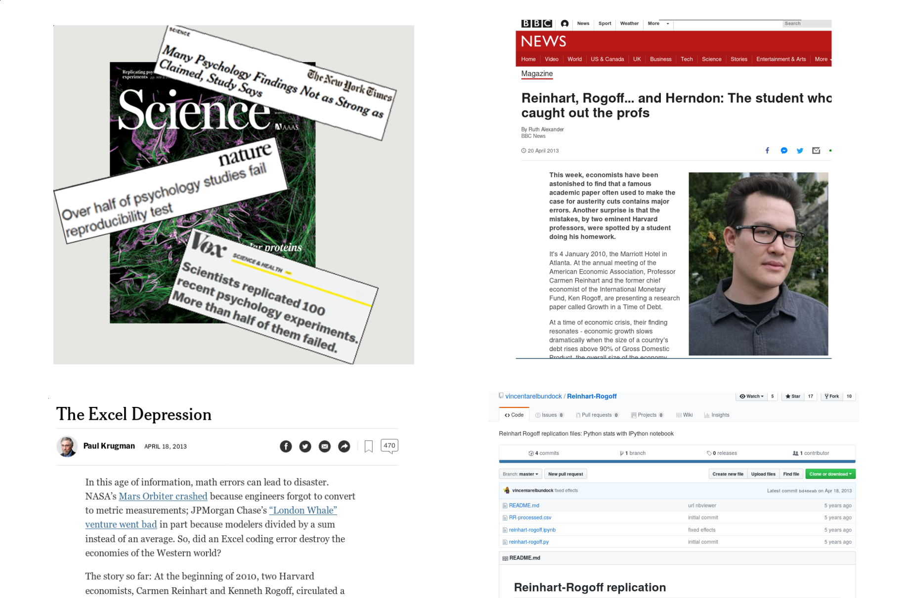
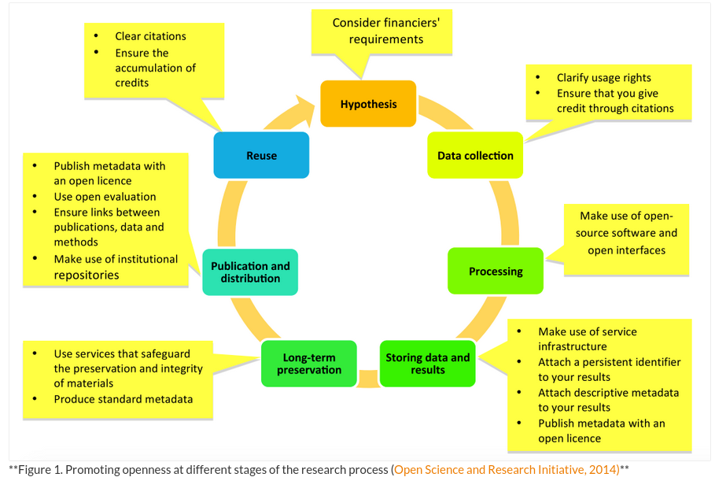
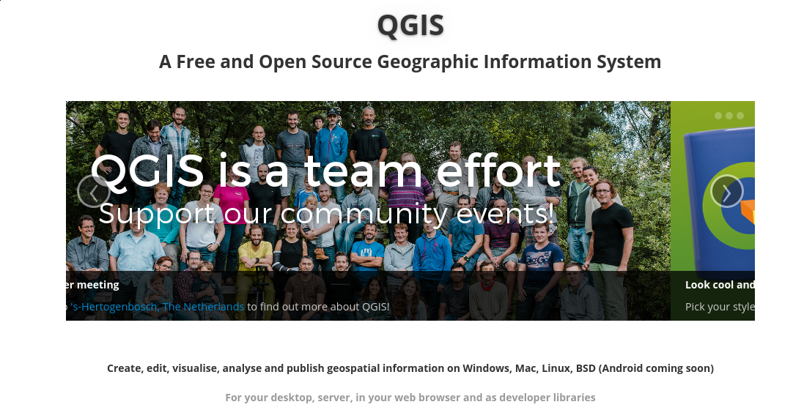
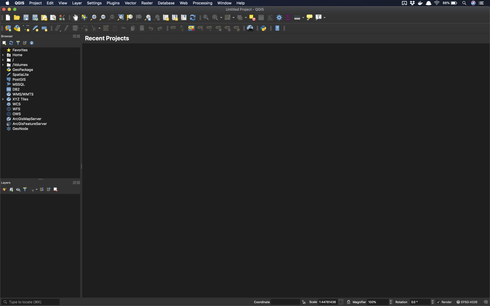
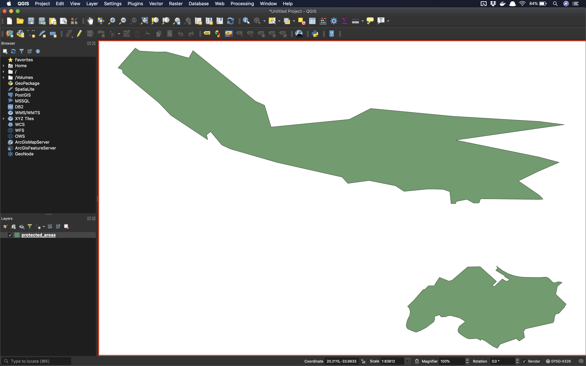
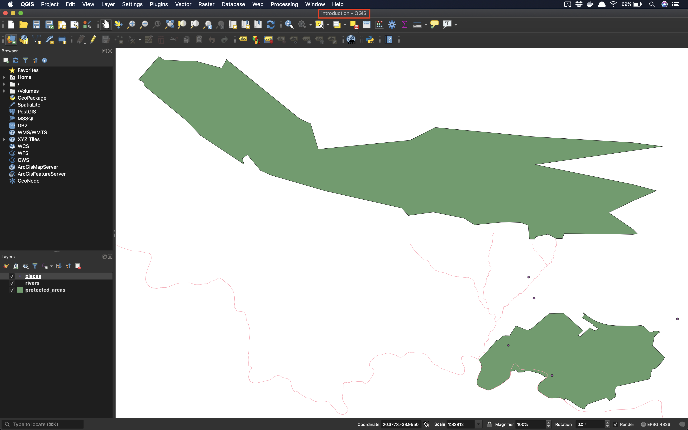

# Open Source GIS 
## GIS Software

## Open Source, Open Science Open Education
### Origins

- Free Software
- Open Source Software

[They are not the same](https://dzone.com/articles/free-software-vs-open-source-vs-freeware-whats-the)

### Freedom
1. Free as in Beer
2. Free as in Speech

### Why Open Source GIS?

[A word from the editor](https://docs.qgis.org/3.16/en/docs/gentle_gis_introduction/preamble.html#a-word-from-the-editor)

### Open Science (Why?)

### Open Science (What?)

[(FOSTER)](https://www.fosteropenscience.eu/content/what-open-science-introduction) 

### Open Education

- access to quality education is everyone's birthright</li>
- human knowledge is a [public good](https://en.wikipedia.org/wiki/Public_good_(economics)) that should be available to all
- human knowledge is a public good that we all can contribute to</li>

## QGIS

### QGIS Community

### Open QGIS

### Load a Vector Layer

### Vector Layer Loaded

### Interface Components

#### Menu Bar

#### Tool Bar

#### Canvas

#### Browser Panel

#### Layer Panel

#### Locator Bar

#### Status Bar

### Working with Projects, Files, and Directories

Load two new layers

#### Projects

#### What is a QGIS Project?

- A `meta-file` that defines the files associated with an analysis
- A `project file` records locations of files related to a `project` 
- Extension: `gqz` 

### Saving a project

### Project Save Dialog

### Project Saved 

### Project File

### Quit QGIS

### Opening Project on a different computer (and operating system)

### Linux File Browser

### QGIS on Linux

### Open Project on Linux

### Our Project on Linux

