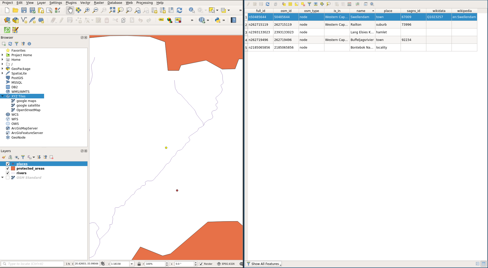

# Data Models

## Last Time

- Open Source/Science/Education
- Introduction to QGIS

## Today

-   (Spatial) Data
-   GIS Data Models
-   Vector Model

## (Spatial) Data

## What is Data?

[[Source]( https://commons.wikimedia.org/w/index.php?curid=37705247)]

## Spatial Data

- Also known as geospatial data
- Observation that identify the geographic locations of
  - features on the Earth
  - boundaries on the Earth
- Stored as coordinates and topology
- 80-100% of all data have a geographical component (Cressie 1993)

## Types of Spatial Data

- Point Pattern Data
- Geostatistical Data
- Lattice (Polygon) Data
- Network Data
- Spatial Interaction Data

## Digital Data

 In order to encode spatial data, we need
 a conceptual view that can form the basis for a data model.
 
 By encode, we mean turn data as observations into digital data that can be used in a GISystem 

## Representation

Two key views of geospatial reality are the:

- object view
- field views

## Object View

- the world is viewed as a set of discrete spatial objects (entities)
- can take different forms
  - points: location of a traffic accident
  - lines: stream segment/river segment
  - areas/polygons: Riverside County
  
## Object View

 

## Field View

- geography seen as a collection of continuous variables
- phenomena could be measured everywhere (at any point in space)
- ex: air pollution, elevation, precipitation

## Field View

#
## GIS Data Models

## GIS Data Models
- Vector Data Model (Today)
- Raster Data Model (Future)

## Vector Data Model

- Each discrete object is considered to be a **feature**
- Vector features have **attributes**, which consist of text or numerical information that describe the features
- A vector feature has its shape represented using **geometry**
- The geometry is made up of one or more interconnected **vertices**

## Vector Geometry

- The geometry is made up of one or more interconnected **vertices**
- A vertex describes a position in space using an X, Y and optionally Z axis. 
- Geometries which have vertices with a Z axis are often referred to as 2.5D since they describe height or depth at each vertex, but not both.

##

##

## 

## Scale and Representation

## Scale and Representation

## Vector Attributes

## Attribute Properties

## Issues with Vector Data

- slivers
- under and overshoots
- topological errors

## Slivers

## Under and overshoots

## Next Up
- Vector Tables
- Queries

