# Data Models

## Last Time

- Open Source/Science/Education
- Introduction to QGIS

## Today

-   (Spatial) Data
-   GIS Data Models
-   Vector Model

## (Spatial) Data

## What is Data?
[!DIKW_Pyramid](./images/02/DIKW_Pyramid.svg)
[[Source]( https://commons.wikimedia.org/w/index.php?curid=37705247)]

## Spatial Data

- Also known as geospatial data
- Observation that identify the geographic locations of
  - features on the Earth
  - boundaries on the Earth
- Stored as coordinates and topology
- 80-100% of all data have a geographical component (Cressie 1993)

## Types of Spatial Data

- Point Pattern Data
- Geostatistical Data
- Lattice (Polygon) Data
- Network Data
- Spatial Interaction Data

## Digital Data

 In order to encode spatial data, we need
 a conceptual view that can form the basis for a data model.
 
 By encode, we mean turn data as observations into digital data that can be used in a GISystem 

## Representation

Two key views of geospatial reality are the:

- object view
- field views

## Object View

- the world is viewed as a set of discrete spatial objects (entities)
- can take different forms
  - points: location of a traffic accident
  - lines: stream segment/river segment
  - areas/polygons: Riverside County
  
## Object View
[!object_view](./images/02/object_view.png)

 

## Field View

- geography seen as a collection of continuous variables
- phenomena could be measured everywhere (at any point in space)
- ex: air pollution, elevation, precipitation

## Field View
[!laAir](./images/02/laAir.png)

#
## GIS Data Models

## GIS Data Models
- Vector Data Model (Today)
- Raster Data Model (Future)

## Vector Data Model

- Each discrete object is considered to be a **feature**
- Vector features have **attributes**, which consist of text or numerical information that describe the features
- A vector feature has its shape represented using **geometry**
- The geometry is made up of one or more interconnected **vertices**

## Vector Geometry

- The geometry is made up of one or more interconnected **vertices**
- A vertex describes a position in space using an X, Y and optionally Z axis. 
- Geometries which have vertices with a Z axis are often referred to as 2.5D since they describe height or depth at each vertex, but not both.

##
[!point_feature](./images/02/point_feature.png)

##
[!polyline_feature](./images/02/polyline_feature.png)

## 
[!polygon_feature](./images/02/polygon_feature.png)

## Scale and Representation

[!riverside_point](./images/02/riverside_point.png)

## Scale and Representation

[!riverside_network](./images/02/riverside_network.png)

## Vector Attributes

[!attribute_table](./images/02/attribute_table.png)

## Attribute Properties

[!attribute_properties](./images/02/attribute_properties.png)

## Issues with Vector Data

- slivers
- under and overshoots
- topological errors

## Slivers
[!vector_slivers](./images/02/vector_slivers.png)

## Under and overshoots

[!vector_overshoots](./images/02/vector_overshoots.png)

## Next Up
- Vector Tables
- Queries

# Open Source GIS 
## GIS Software

## Open Source, Open Science Open Education
### Origins

- Free Software
- Open Source Software

[They are not the same](https://dzone.com/articles/free-software-vs-open-source-vs-freeware-whats-the)

### Freedom
1. Free as in Beer
2. Free as in Speech

### Why Open Source GIS?

[A word from the editor](https://docs.qgis.org/3.16/en/docs/gentle_gis_introduction/preamble.html#a-word-from-the-editor)

### Open Science (Why?)

### Open Science (What?)

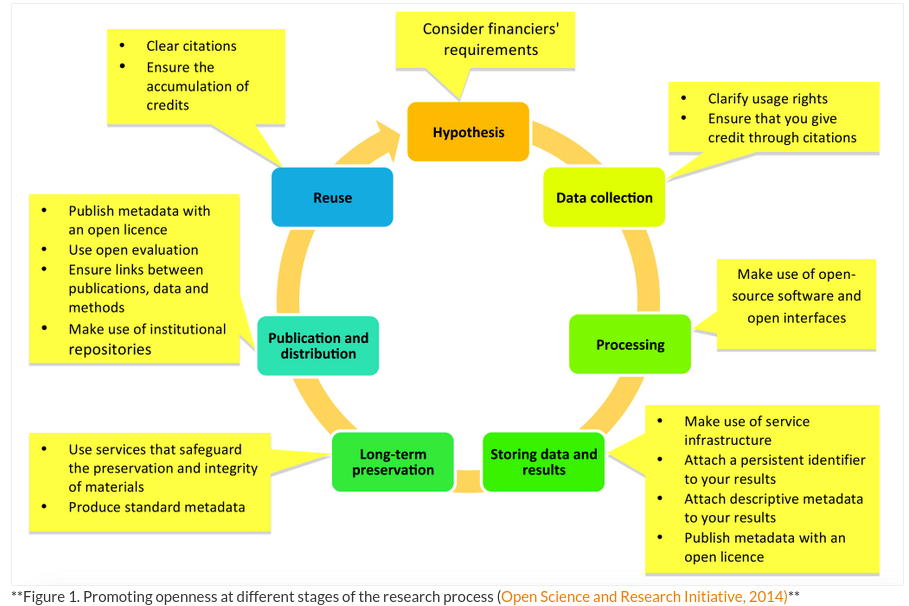
[(FOSTER)](https://www.fosteropenscience.eu/content/what-open-science-introduction) 

### Open Education

- access to quality education is everyone's birthright</li>
- human knowledge is a [public good](https://en.wikipedia.org/wiki/Public_good_(economics)) that should be available to all
- human knowledge is a public good that we all can contribute to</li>

## QGIS

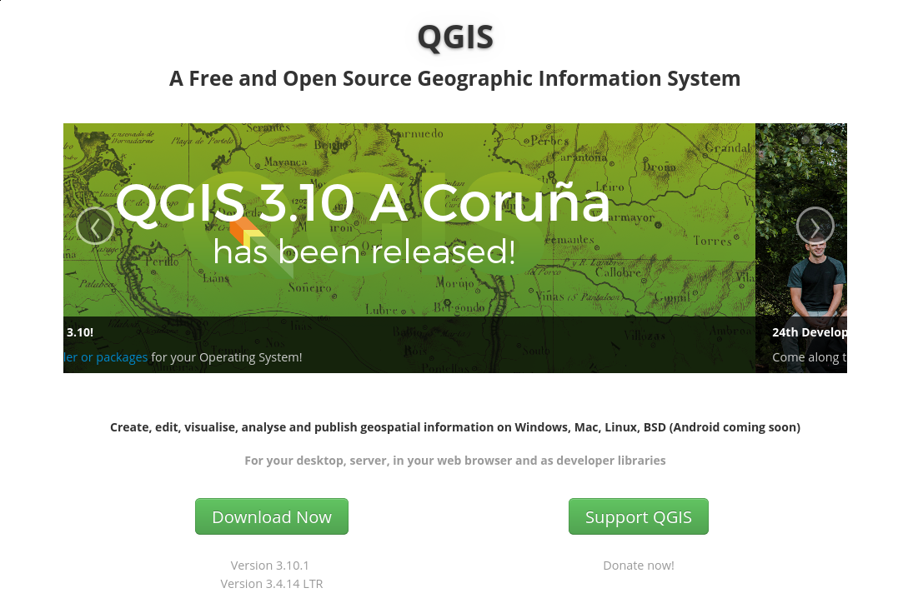

### QGIS Community
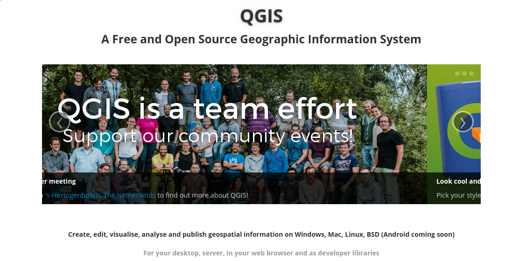

### Data
For this lecture, download our [example data](https://github.com/sjsrey/pbpl010s21/raw/main/docsrc/data/QGIS-Training-Data-2.0.zip)

### Open QGIS
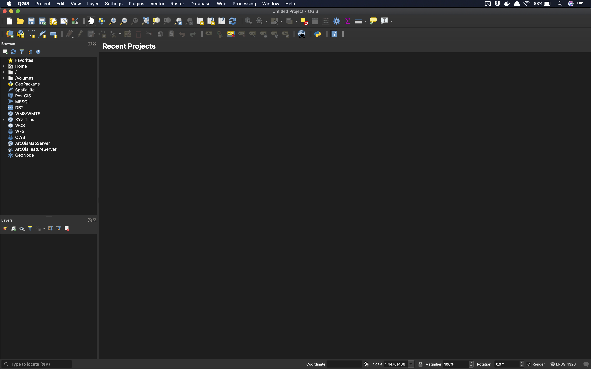

### Load a Vector Layer

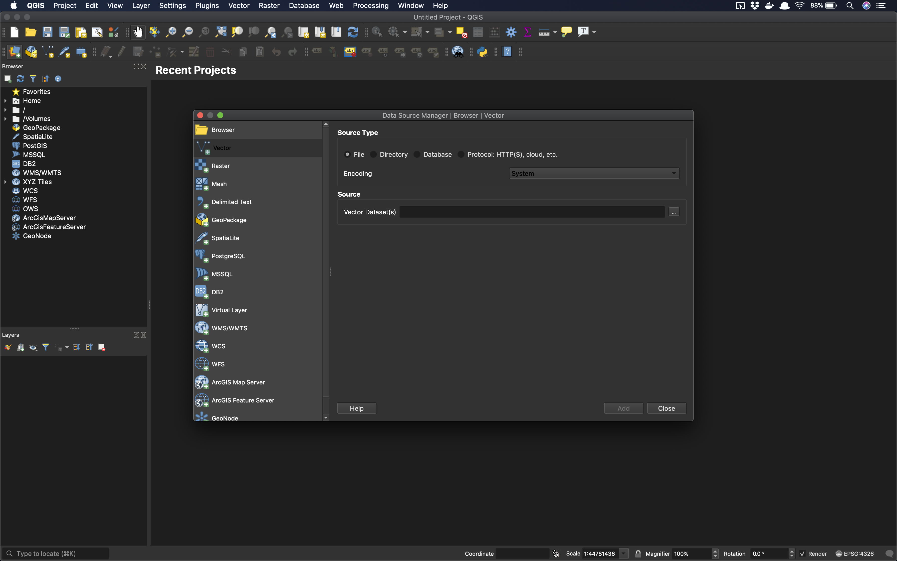

### Vector Layer Loaded

### Interface Components

#### Menu Bar

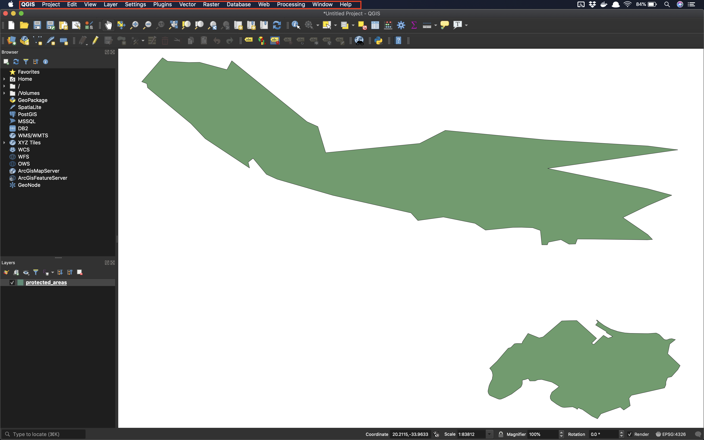

#### Tool Bar

#### Canvas

#### Browser Panel

#### Layer Panel

#### Locator Bar

#### Status Bar
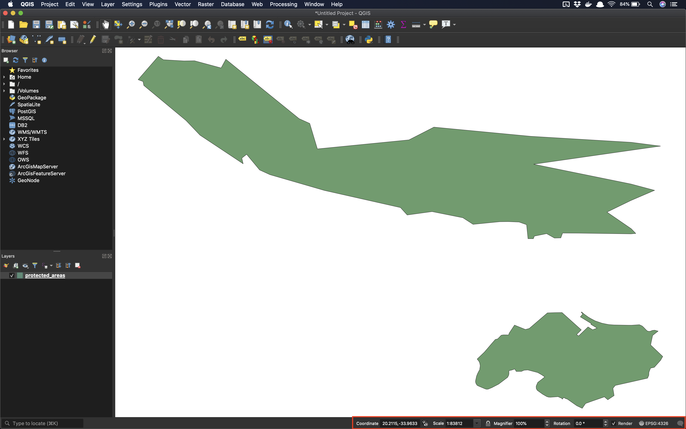

### Working with Projects, Files, and Directories

Load two new layers

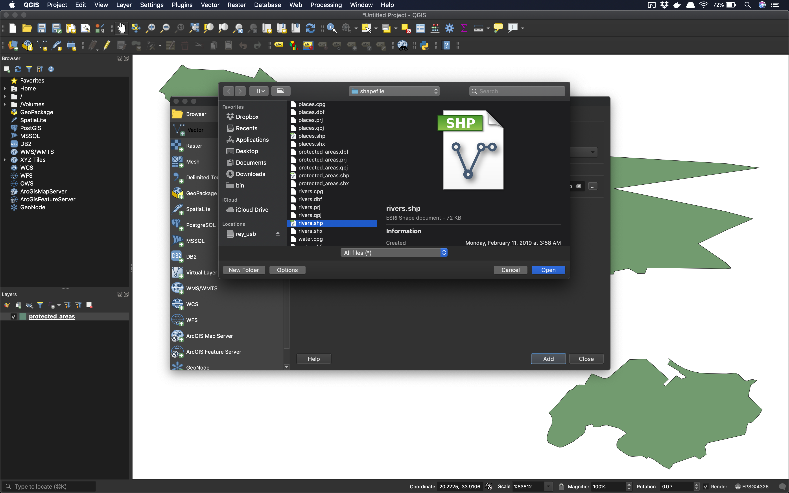

#### Projects

#### What is a QGIS Project?

- A `meta-file` that defines the files associated with an analysis
- A `project file` records locations of files related to a `project` 
- Extension: `gqz` 

### Saving a project

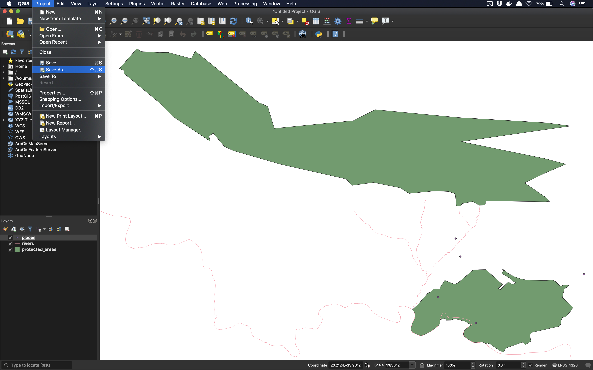

### Project Save Dialog

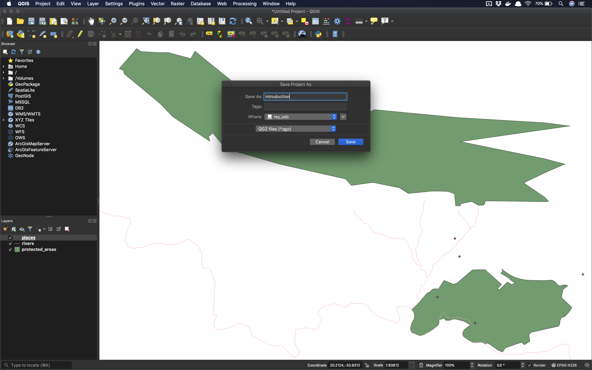

### Project Saved 

### Project File

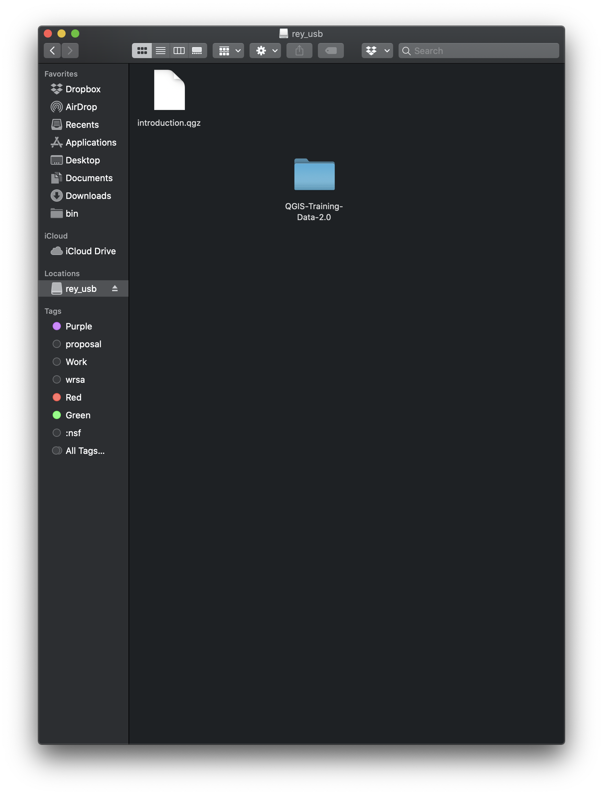

### Quit QGIS

### Opening Project on a different computer (and operating system)

### Linux File Browser

### QGIS on Linux

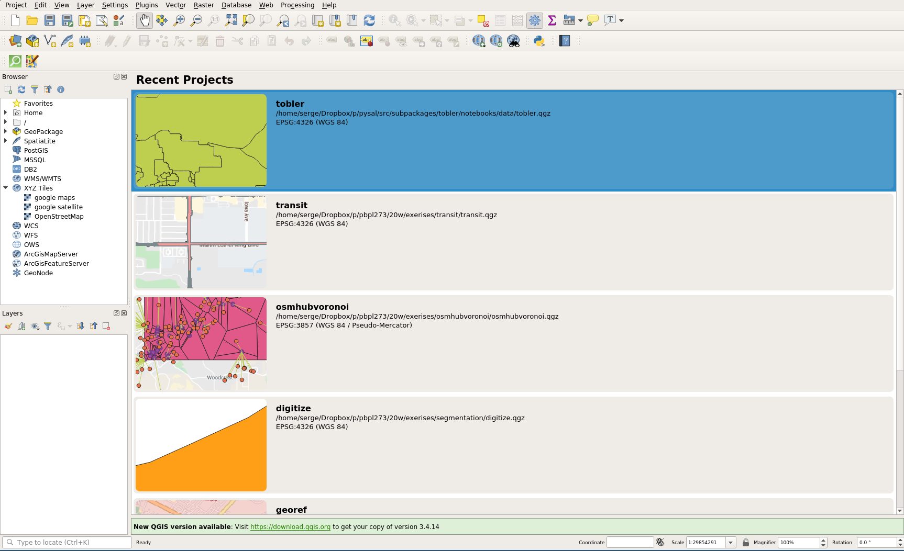

### Open Project on Linux

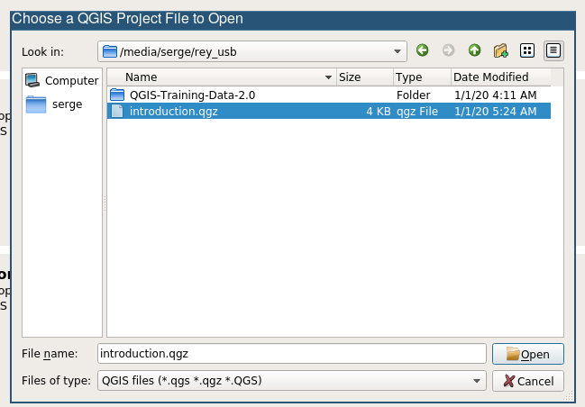

### Our Project on Linux

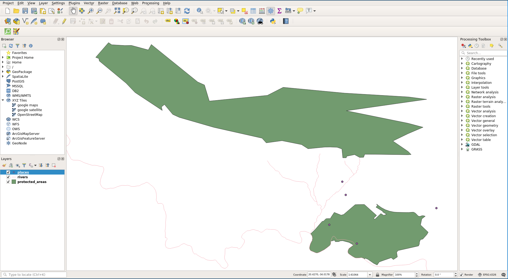

