# Vector Analysis

## Last Time

<ul>
<li class="fragment"> Detecting Geometry Problems </li>
<li class="fragment"> Understanding Geometry Problems</li>
<li class="fragment"> Fixing Geometry Problems</li>
</ul>

## Today

<ul>
<li class="fragment"> Deterministic Spatial Analysis</li>
<li class="fragment"> Buffers and Buffering</li>
<li class="fragment"> Select by Location</li>
<li class="fragment"> Health Deserts</li>
</ul>

#
## Deterministic Spatial Analysis

## Dimensions of vector geometries

<ul>
<li class="fragment"> Point: 0-dimension </li>
<li class="fragment"> Line: 1-dimensional (length) </li>
<li class="fragment"> Polygon: 2-dimensional (area) </li>
</ul>

## Spatial Relations

## Dimensionally Extended nine-Intersection Mode (DE-9IM)
##
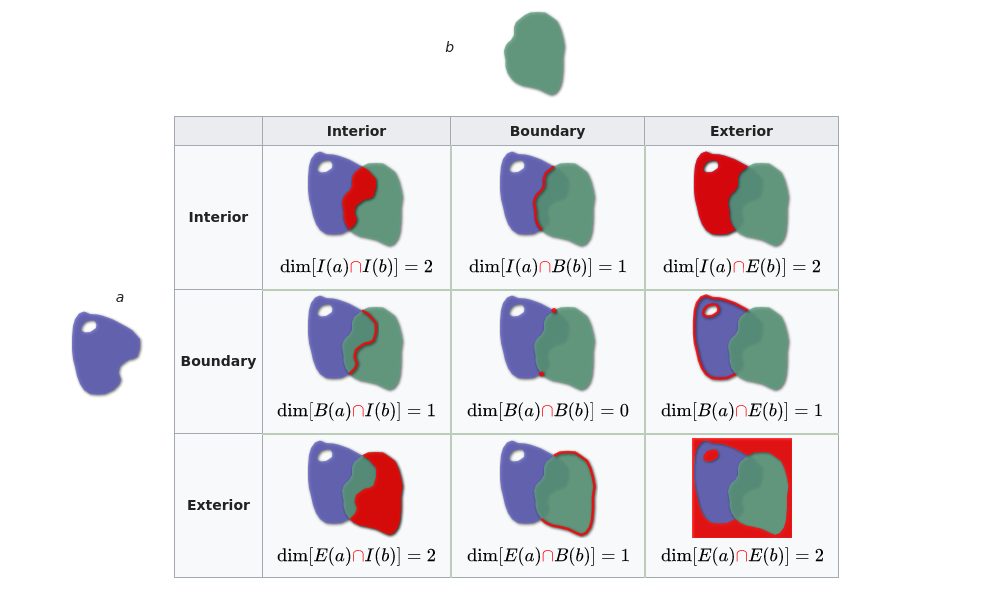

[[url]](https://en.wikipedia.org/wiki/DE-9IM)

## Food Deserts [url](https://proceedings.esri.com/library/userconf/healthy-communities10/pdfs/mapping-food-deserts.pdf)
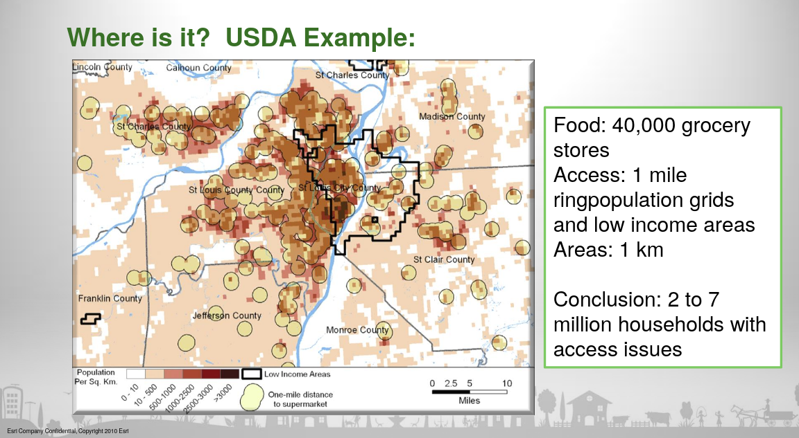
[[url]](https://proceedings.esri.com/library/userconf/healthy-communities10/pdfs/mapping-food-deserts.pdf)

## Today: Clinic Deserts

[data](https://sergerey.org/gis4pp20/slides/data/lecture_10.zip)

##

##

##
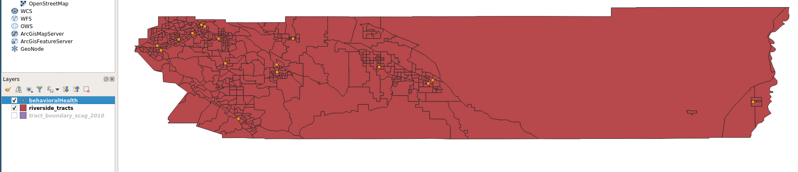

##

#
## Buffers and Buffering

## Buffers

## Buffers (Variable)
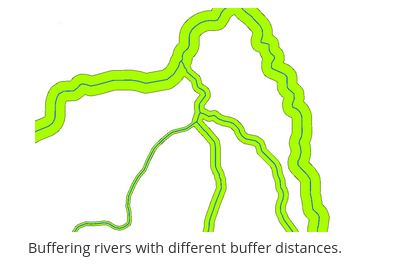

## Buffers (Rings)
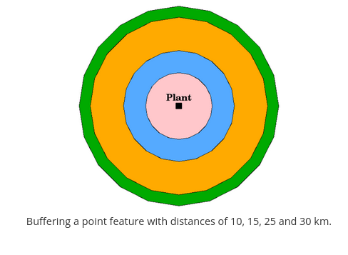

## Buffers (Dissolve)

## Buffering the Clinics
<ul>
<li class="fragment">food deserts: 0.5 mile distance  </li>
<li class="fragment">use for the clinic points </li>
<li class="fragment">will revisit other distances later </li>
</ul>

## .5 mile clinic buffer 
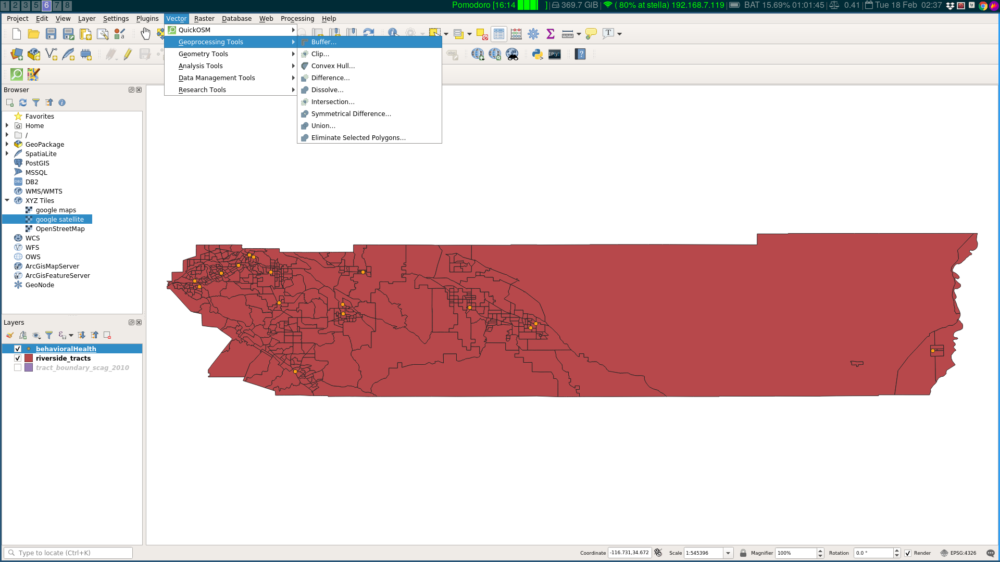

##  buffer menu

## buffer result

## buffer result: geometry

## buffer rename

#
## Buffering

## Using the Buffers for Locational Analysis

<ul>
<li class="fragment"> Find what tracts intersect with the buffers </li>
<li class="fragment"> Create layer with these tracts </li>
<li class="fragment"> Use: Select by Location </li>
</ul>

## Processing: Select by Location
(Bring up Processing Toolbox with CTRL-ALT-T)
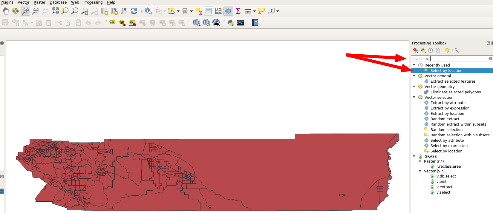

## Processing: Select by Location Dialog
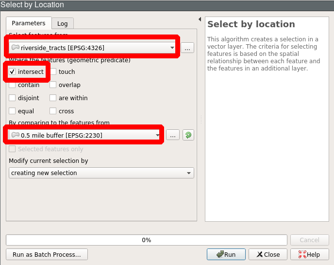

## What tracts intersect with the .5 mile buffers?
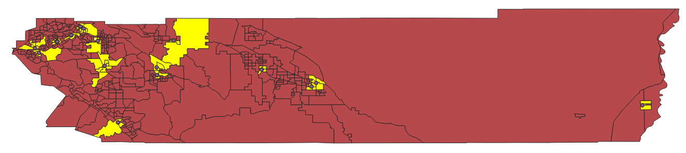

## Save Layer

## Saved Layer

#
## Health Deserts

## Traditional Approach
<ul>
<li class="fragment"> Tracts *not* intersecting buffers </li>
<li class="fragment"> Add up population in **desert polygons** </li>
</ul>

## Identifying Clinic Desert Tracts

## Clinic Desert 
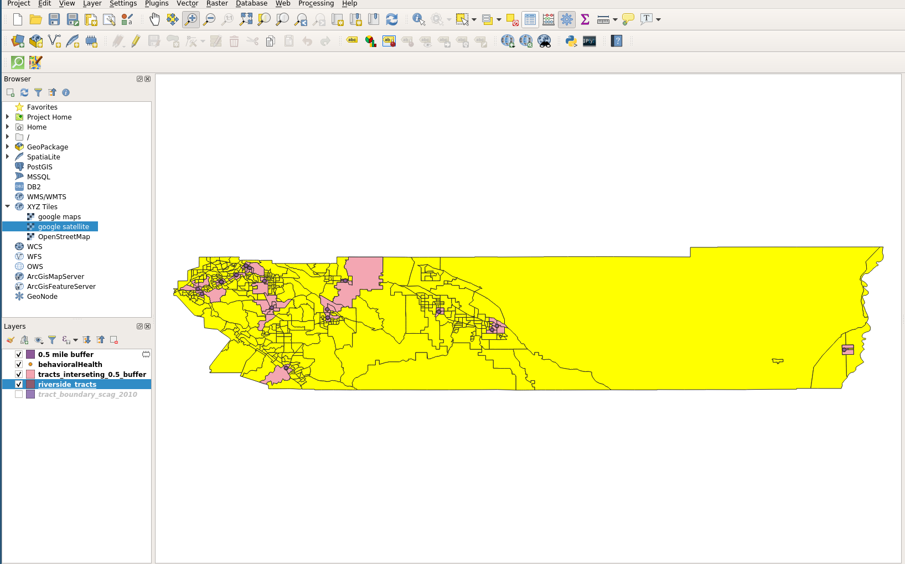

## Clinic Desert  Layer
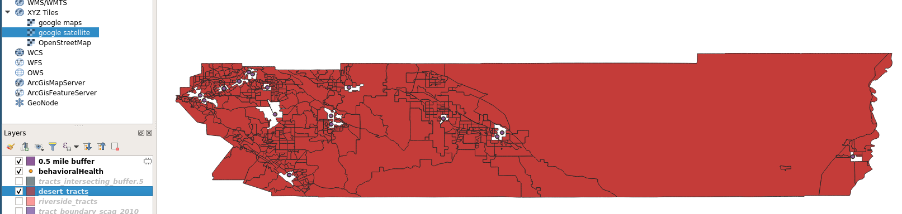

## What is the population residing in Clinic Desert?

## Desert Tracts Tables

## Basic Statistics for Fields

## Basic Statistics for Fields: Dialog

## Basic Statistics for Fields: Results

## Basic Statistics for Fields: File

## Basic Statistics for Fields: File
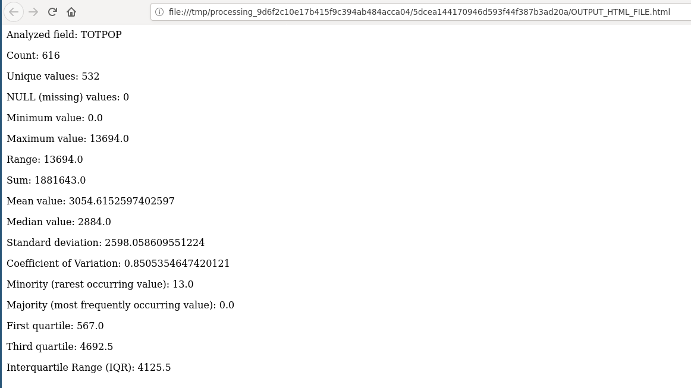

## Total County Tract Population

## Population Estimates

- County Total: 2,189,641 
- In Clinic Desert Tracts: 1,881,643 
- In Buffer Tracts: 307,998
- Population with access problems: 1,881,643

## Issues in measuring access to clinics

- all individuals in the tracts intersecting the buffers are in the buffer
- overestimation of people within .5 miles of a clinic
- underestimation of people in the clinic desert

## Why overestimation of buffer population?

## We can do better

## Buffer Tracts

## Random Points

## Random Points Generated

## Random Points Layer

## Random Points Layer Symbology

## Random Points Layer 

## Count points in buffers: Layers 

## Count points in buffers
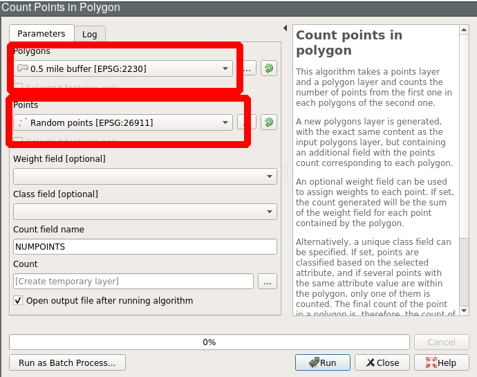

## Points in polygons

## Count Field

## Count Summary
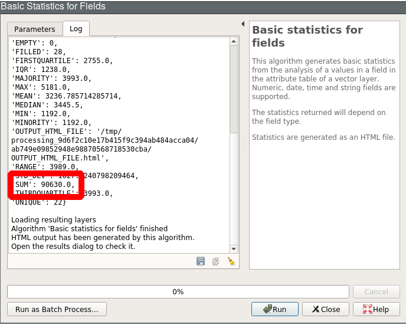

## Count Table

## Revised Estimates
- County Total: 2,189,641 
- In Clinic Desert Tracts: 1,881,643 
- In Buffer Tracts: 307,998
  -  90,630 in buffer, in tract
  - 217,358 out of buffer, in tract
- Population with access problems: 2,099,011
- Population within .5 miles of clinic: 90,630

## Issue
- double counting
- points contained in more than a single buffer are counted more than once

## Overlapping Buffers

## Count Table With Overlapping Buffers

## Fix
- dissolve on buffering

## Buffer and Dissolve

## Dissolved Buffer

## New Buffer

## New Buffer Feature Count
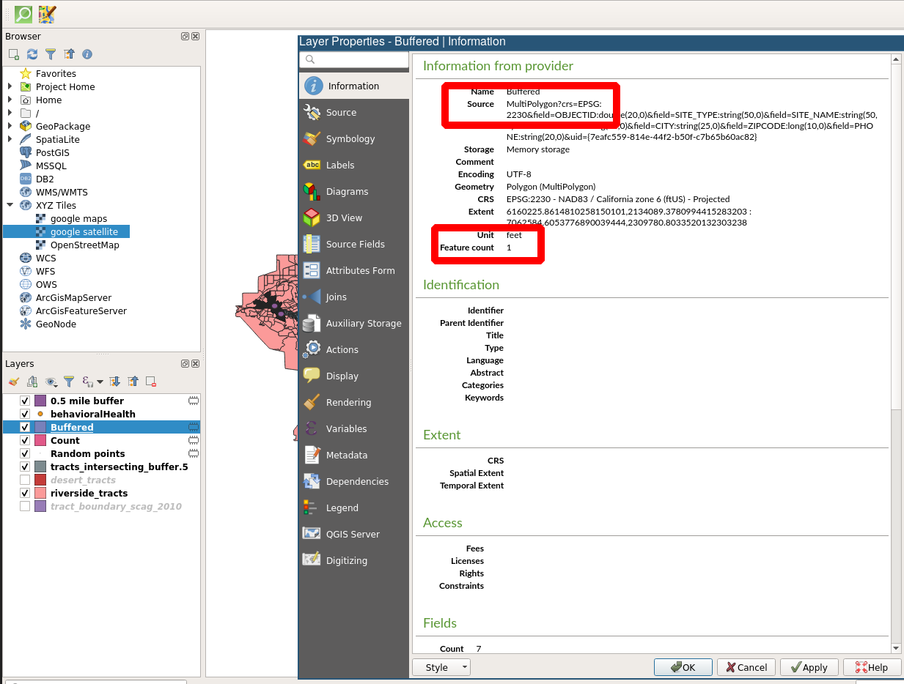

## Points in Polygon Count
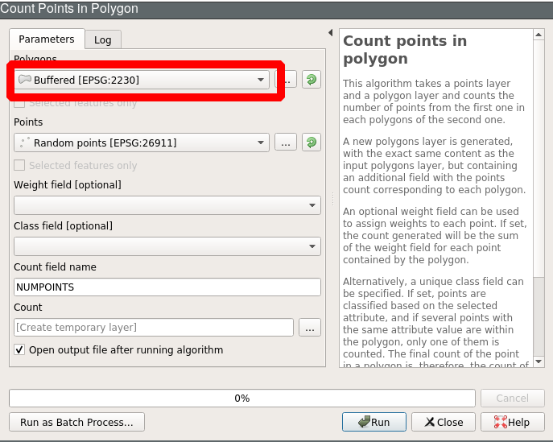

## Population within .5 Miles of a Clinic
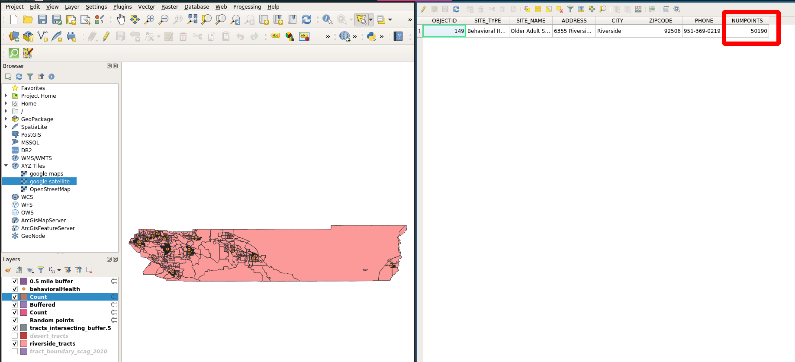

## Revised Estimates
- County Total: 2,189,641 
- In Clinic Desert Tracts: 1,881,643 
- In Buffer Tracts: 307,998
  -  50,190 in buffer, in tract (no double counting)
  - 257,808 out of buffer, in tract
  
  
- Population with access problems: 2,139,451
- Population within .5 miles of clinic: 50,190

## Next Up
- Vector Analysis: Clipping and Spatial Joins

