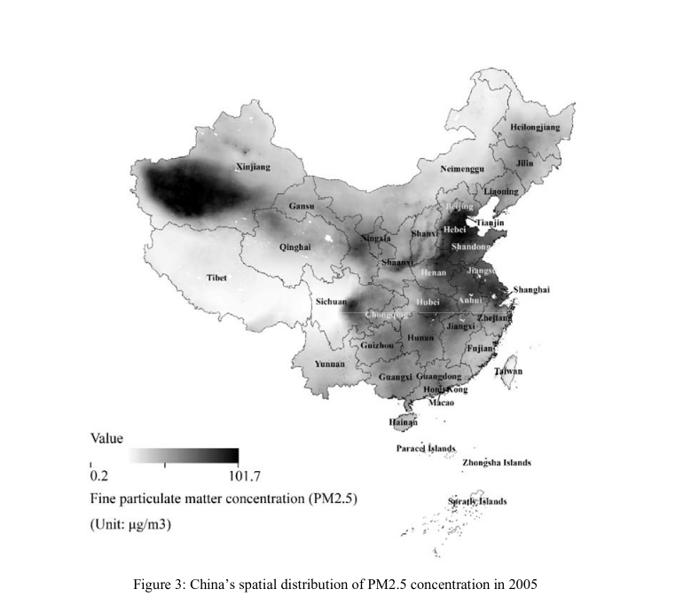
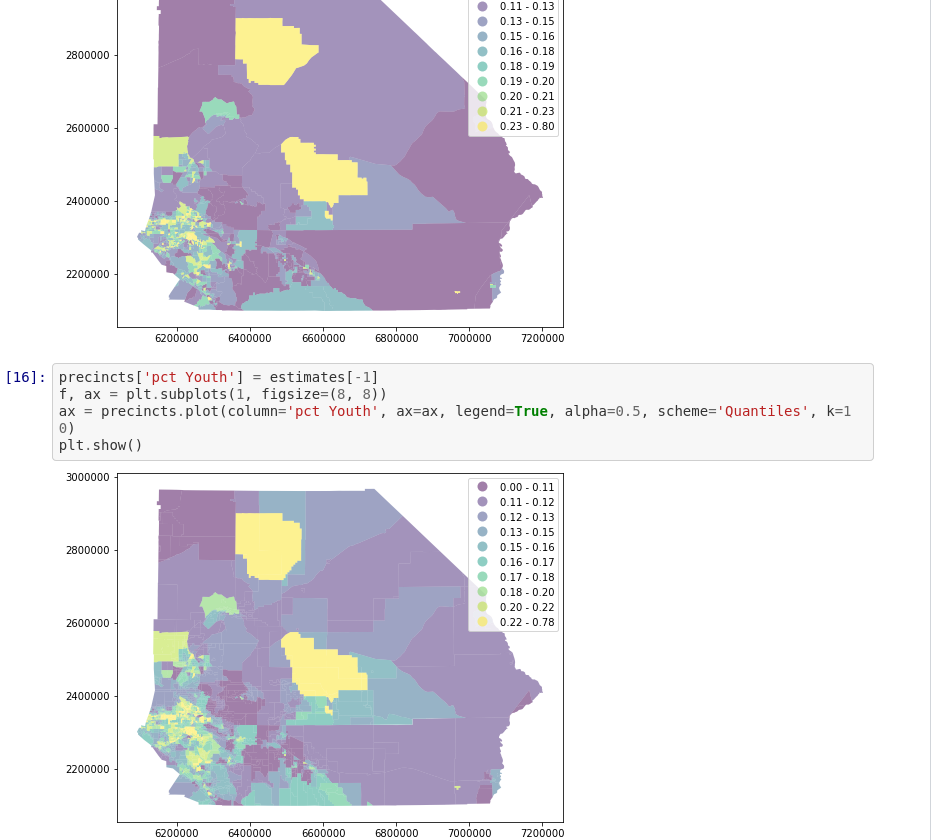

% Geographic Information Systems for Public Policy - Lecture V 
% Raster Data Models
%[Sergio Rey](http://sergrey.org)

## Last Time

- Vector Attributes
- Table Joins
- Virtual Layers

## Today

-   Raster Data Model
-   Conversions
-   Rasters in Public Policy/Social Sciences

#
## Raster Data Model

- Rasters composed of a matrix of pixels (cells)
- Each pixel contains a value representing the conditions for the area covered by that pixel

##

## Advantages of Rasters
- Representing *continuous* spatial variation
- More efficient than small polygons (in the vector model)

## Georeferencing Rasters
- Defines the correspondence between each pixel and location on the earth's surface
- Coordinates of top left pixel in the images
- Size of each pixel in X and Y direction
- Rotation angle

## Raster in QGIS

## Raster in QGIS

## Sources of raster data

## Remote Sensing Satellites 

## Remote Sensors

## Planet

## Earth Engine Timelapse

##

['url'](https://earthengine.google.com/timelapse/)

## Remote Sensing Imagery Resolution

- Spatial Resolution
- Spectral Resolution
- Temporal Resultion

## Spatial Resolution

How much area is represented in each pixel

<ul>
<li class="fragment">MODIS 500m x 500m  </li>
<li class="fragment">SPOT5 satellites: 10m x 10m </li>
<li class="fragment">Areal Photography, drones: 50cm x 50cm  </li>
</ul>

__Remember__: images with pixel size covering a _small area_ are called _high resolution_ images.

## Spatial Resolution and Scale

<table>
<col width="50%">
<col width="50%">
<tr>
<td>

</td>
<td>

</td>
</tr>
</table>

## Spectral Resolution

- The number of spectral bands in which a sensor can collect reflected radiance
- Choice depends upon application of use
- Different types of ground targets have different spectral signatures

## Temporal Resolution

Revisit Periods for Satellites

<ul>
<li class="fragment">SPOT5 - 3 days  </li>
<li class="fragment"> Modis - daily </li>
<li class="fragment"> Airborne - as needed </li>
</ul>

#
## Conversions

## Which Model? 

## Vector to raster conversion 

## Raster to vector conversion

#
## Rasters in GIS for Public Policy

- Measures of environmental variables
- Risk surfaces
- Dasymetric mapping and areal interpolation

## Environmental variables

[Freeman et al. (2017)](https://scholar.harvard.edu/files/freeman/files/willngess_to_pay_for_clean_air_in_china_ms-for-dash_freeman-laing-song-timmins_dec2017.pdf) "Willingness to pay for clean air in China"

## FEMA: Risk Surface

## Dasymetric Mapping

## NSF-Neighborhoods

##

## Interpolation and Harmonization

##

## Tobler

## Tobler: Voting Precincts

## Tobler: Dasymetric

## National Land Cover Database

## Next Up
- Coordinate Reference Systems

#
 GIS for Public Policy'20 by <a xmlns:cc="http://creativecommons.org/ns#" href="http://sergerey.org" property="cc:attributionName" rel="cc:attributionURL">Sergio Rey</a> is licensed under a <a rel="license" href="http://creativecommons.org/licenses/by-sa/4.0/">Creative Commons Attribution-ShareAlike 4.0 International License</a>.

