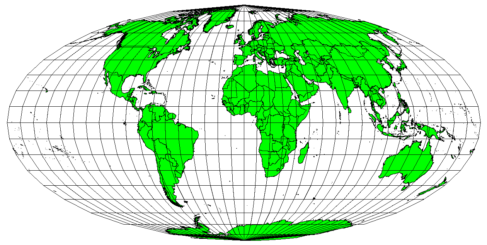

% Geographic Information Systems for Public Policy - Lecture VI
% Coordinate Reference Systems
%[Sergio Rey](http://sergrey.org)

## Last Time

- Rasters

## Today

-   Coordinate Reference Systems
-   Map Projections

#
## Coordinate Reference Systems

## Earth

- Equatorial circumference: 24,901 miles (40,075 km)
- Meridional circumference: 24,860 miles (40,008 km)

## Earth

- Equatorial circumference: 24,901 miles (40,075 km)
- Meridional circumference: 24,860 miles (40,008 km)

## 

## 

## Coordinate Reference Systems

- Geographic Coordinate Systems
- Projected Coordinate Systems

## Geographic Coordinate System

##

## Geographic Coordinate System

- lines of latitude
  - parallel to the equator
  - 180 equally spaced sections from North to South
  - each hemisphere divided into ninety sections (0-90 degrees)
- lines of longitude
  - perpendicular to the equator
  - converge at the poles
  - 0-180 E(+) or W(-) of prime Meridian 

## Why Math in GIS?

## Projected Coordinate Systems

##

## Universal Transverse Mercator (UTM)

- Global _map projection_
- 60 equal zones of 6 degrees of longitude (1-60)

##

##

##

## UTM

- northing (Y) value
  - distance from equator in meters
- easting (X) value
  - distance from zone central meridian
  
  
## Coordinates for Point of interest

- UTM Zone 35S
- 35 415,000 m E/ 6,540,000 m N
- Coordinates from the point of origin of the zone
  - intersection of equator and zone central meridian
- Southern Hemisphere: northings decrease to the south

## UTM: northing (Y)

- Place of interest: 3,550,000 meters south of the equator
- northing (Y): -3,550,00000
- Add false northing of 10,000,000
- 6,450,000m

## UTM: easting (X)
- Central meridian for UTM Zone 35s: 27 degrees easting
- Place of interest is 85,000 meters West of this
- -85,000m
- False easting of 500,000m
- easting (X): 415,000

#
## Map Projections

## 

## Map Projection Characteristics

- Class
- Case
- Aspect

## Class 

## Case

## Aspect: Projection's Center

- equatorial: centered somewhere along equator
- polar: centered about one of the poles
- oblique: between poles and equator 

## Accuracy of Map Projections

- Angular distortion
- Distance distortion
- Area distortion

## Angular Conformity: Mercator

- maintain 90 degrees for compaass rose (N,S,E,W)
- difficult for large areas
- only used for small portions of earth surface
- distorts area
- uses: navigation and meterological tasks

##

## Equal Distance: Plate Carree Equidistant Cylindrical

- scale of the map is kept constant
- accurate distances from the center of projection to any other place
- accurate along given lines
- uses: radio and seismic mapping

##

## Equal Area: Mollweide Equal Area Cylindrical

- preserves proportional relationships of mapped areas to areas on the Earth
- uses: when area needs to be measured (density, deforestation) 
- distortions of angular conformity

##

## Map Projections

- Each map projection has advantages and disadvantages
- The best projection for a map depends on the scale of the map, and on the purposes for which it will be used.
- A projection may have unacceptable distortions if used to map the entire African continent, but may be an excellent choice for a large-scale (detailed) map of your country.

## On-The-Fly Projection

- Project starts with a given CRS
- Subsequently loaded layers get projected to that CRS
- Allows overlays of layers with different CRSs

## Next Up
- Map Production

#
 GIS for Public Policy'20 by <a xmlns:cc="http://creativecommons.org/ns#" href="http://sergerey.org" property="cc:attributionName" rel="cc:attributionURL">Sergio Rey</a> is licensed under a <a rel="license" href="http://creativecommons.org/licenses/by-sa/4.0/">Creative Commons Attribution-ShareAlike 4.0 International License</a>.

