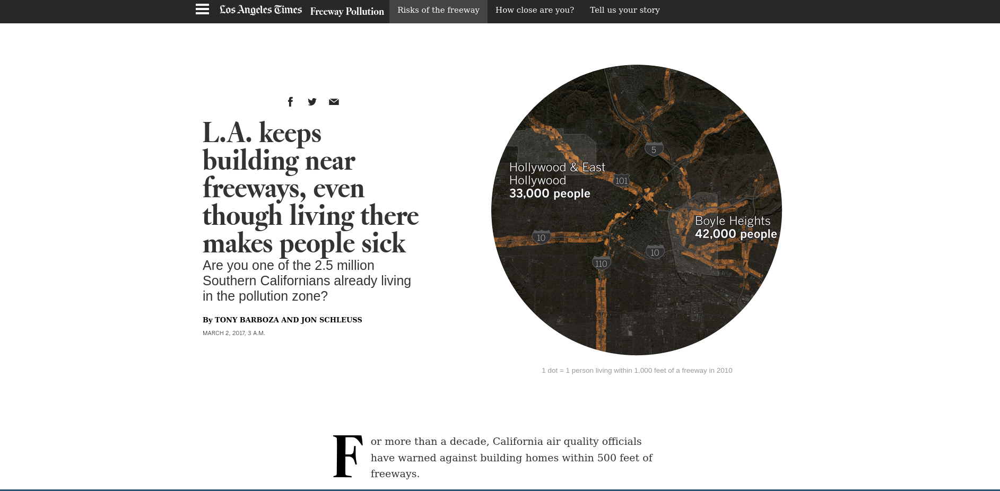

# PBPL010 Project

## Description

This quarter we will work on a collaborative course project that applies the methods we have been covering in lecture sessions. During the
second half of the quarter, we will dedicate the discussion sessions for in-class
collaboration on the projects. Collaboration outside regular class time will
also be required to complete the projects.

We will be replicating, and extending, the [LA Times](https://www.latimes.com/projects/la-me-freeway-pollution/)
investigation of environmental disparities in Los Angeles. Although the original article makes reference to "Southern California", the data provided with the original article is only for the City of Los Angeles. As such we will extend this analysis to consider all the counties belonging to  the Southern California Association of Governments, and the San Diego Association of Governments.

We will be focusing on data for the 2010 Census year.

## Tasks
1. Using the data provided in the LA Times Article, determine the population living within 500 and 1000 feet of a freeway.
2. Using tract data from the US Census (3 below) and the California Highway System (5 below), repeat this exercise for the same extent as in task 1. 
3. Using block data from the US Census (4 below) and the California Highway System (5 below), repeat this exercise for the same extent as in task 1. 
4. Compare the estimates for the two sets of analyses (Task 1-Original Article and Task 3-block data)
6. Compare the estimates for the two sets of analyses (Task 2-tract data and Task 3-block data)
7. For each county in the combined SCAG and SANDAG regions repeat task 2.
8. Discuss the relative highway pollution burden for populations in each of the counties.
9. Create a new variable at the tract level that represents the population for people of color.
11. Carry out an equity analysis to explore whether there are disparities in the exposure to freeway pollution between this group and the white population in each of the counties.

## Data

1. [LA Times Freeway Data](https://latimes-graphics-media.s3.amazonaws.com/assets/data/freeway-pollution/freeway_files.zip)
3. [California Census Tract Data](https://www.census.gov/geographies/mapping-files/2010/geo/tiger-data.html)
4. [California Census Block Data](ftp://ftp2.census.gov/geo/tiger/TIGER2010BLKPOPHU/tabblock2010_06_pophu.zip)
5. [California Highway Network Data](https://stacks.stanford.edu/file/druid:xc453kn9742/data.zip?download=true)
6. [Documentation for Census Data](https://www.census.gov/programs-surveys/geography/technical-documentation/records-layout/tiger-line-demo-record-layouts.html)

