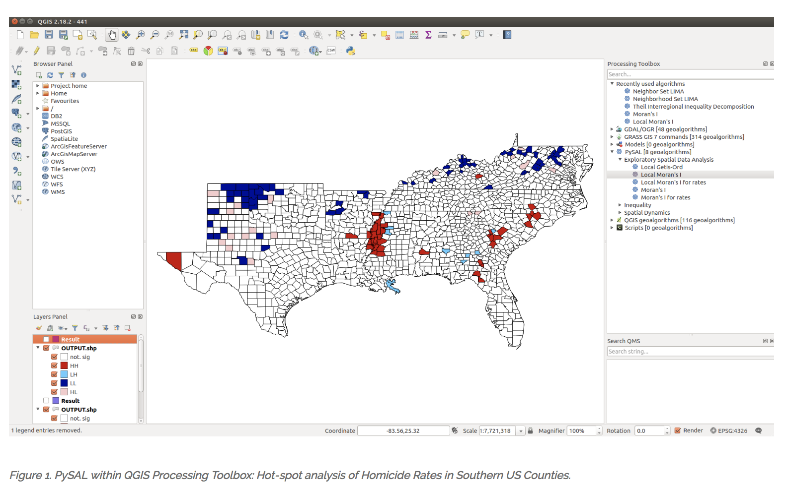

# PBPL010 Introduction to Geographic Information Systems

Instructor: **Sergio Rey**  
Office Hours (Zoom): Monday 3:30-4:30 (or by appointment)  

Meeting Times: Monday and Wednesday 2:00-3:00  (Zoom)  
Discussion: Wednesday 1:00-1:50 (Zoom)  

## Description

This course introduces the fundamental concepts of geographic
information systems (GIS), geographic information science (GIScience),
spatial data, and applications of spatial analysis in the social
sciences and public policy.

In the scope of a 10-week quarter course we can only introduce a handful
of the key concepts and methods relevant to GIS for Public Policy. As
such, the course is not intended as an exhaustive treatment. Instead,
the goal is that students will acquire an understanding of the more
common and useful methods and practices, and use the course as an entry
point for further engagement with the field.

## Course Objectives

At the end of this course students will:

-   possess a sound understanding of fundamental spatial concepts and
    theory;
-   know how to locate, import, manipulate, display, and analyze
    geographical data in open source computational tools;
-   have the ability to apply GIScience concepts and methods in public
    policy and social science research.

## Computational Learning

-   We will using [open source](<https://en.wikipedia.org/wiki/Open-source_software>)
    geospatial software throughout the course, primarily
    [QGIS](<https://qgis.org/en/site/>)
-   No prior programming experience is assumed and all computational
    concepts are presented in a self-contained manner
-   Students are strongly encouraged to install these
    packages on their personal computers to facilitate working outside
    of meeting times.

## Course Structure

-   We will meet Mondays and Wednesdays.
-   First part of the meeting will be in lecture format where we cover
    core GIS concepts and theory.
-   Second part of the meeting will be more hands on where we explore
    GIS software to engage with the core concepts introduced in part
    one. We will also dedicate some Wednesdays for collaboration on the course project

## Grading

| Component       |   Points |
| :-------------- | -------: |
| Exercises       |       40 |
| Midterm         |       25 |
| Project         |       30 |
| Collaboration   |        5 |

### Exercises

Four exercises will be introduced in class and are to be completed
outside of meeting times. Collaboration on exercises is encouraged with
the understanding that you alone are responsible for mastering the
material. Collaboration is not allowed on the exam, and material
from the exercises will form the bases of some examination questions.

### Exam

-   There will be one mid-term exam given will be given in-class which will be closed-book
-   Reviews will be held during the meeting prior to the exam
-   Makeups for the exam will be given in cases of unforeseen emergencies
-   Makeups will consist of a 1-hour oral examination

### Collaboration

You have the opportunity to earn a total of 5 collaboration points.
Collaboration here means you make a contribution that improves the
course experience for all.

Points can be earned for the following contributions:

-   An approved review question (1 pt)
-   An approved answer to a review question (1 pt)
-   Presenting a topic during the review (3 pt)
### Review Questions

-   Can be submitted anytime up to 1 week before the midterm
-   Must be submitted through ilearn
-   Have to be approved by the professor for credit

### Project

Each student will contribute to a group project that applies the methods
introduced in the course to a public policy issue approved by the instructor.
Details on the project will be given in the second week of class. During the
second half of the quarter, we will dedicate the discussion sessions for in-class
collaboration on the projects. Collaboration outside regular class time will
also be required to complete the projects.

## Schedule (Planned)

### Week 1 March 29, 31

#### March 29: Course Introduction
  - [Syllabus](syllabus)
  
#### March 31: Introduction to GIS
  - <a href="https://mgimond.github.io/Spatial/introGIS.html">Reading: Gilmond, M. "Intro to GIS and Spatial Analysis"</a>
  - <a href="https://docs.qgis.org/3.16/en/docs/gentle_gis_introduction/introducing_gis.html">Reading: Sutton, T. "Introducing GIS" </a>
  - [Introduction to GIS](./lectures/00_introtogis.md)
  - Downloading QGIS 3.16.5 LTR
    
    - [Windows](https://qgis.org/downloads/QGIS-OSGeo4W-3.16.5-1-Setup-x86_64.exe)
    - [Mac](https://qgis.org/downloads/macos/qgis-macos-ltr.dmg)
    - [Linux](https://qgis.org/en/site/forusers/alldownloads.html#linux)
    
-----
### Week 2: April 5, 7

#### April 5: Introduction to QGIS
  - <a href="https://docs.qgis.org/3.16/en/docs/training_manual/index.html">Reading: QGIS Training Manual, Ch. 1-2</a>
  - [Introduction to QGIS](lectures/01_opensource)
  - [Exercise 1 Out](lectures/e1.md)

#### April 7: Data Models
  - <a href="https://mgimond.github.io/Spatial/feature-representation.html">Reading: Gilmond, M. "Feature Representation"</a>
  - <a href="https://docs.qgis.org/3.16/en/docs/gentle_gis_introduction/vector_data.html">Reading: Sutton, T. "Vector Data" </a>
  - [GIS Data Models](lectures/02_datamodels.md)
-----
### Week 3 April 12, 14

#### April 12: Attributes and Attribute Tables
  - <a href="https://docs.qgis.org/3.16/en/docs/gentle_gis_introduction/vector_attribute_data.html">Reading: Sutton, T. "Vector Attribute Data" </a>
  - [Vector Attributes and Tables](lectures/04_vector_attributes.md)

#### April 14: Rasters
  - <a href="https://docs.qgis.org/3.16/en/docs/gentle_gis_introduction/raster_data.html">Reading: Sutton, T. "Raster Data" </a>
  - [Rasters](lectures/05_rasters.md)
  - Exercise 1 Due
  - Exercise 2 Out
-----
  
### Week 4 April 19, 21

#### April 19: Coordinate Reference Systems
  - <a href="https://docs.qgis.org/3.16/en/docs/gentle_gis_introduction/coordinate_reference_systems.html">Reading: Sutton, T. "Coordinate Reference Systems" </a>
 
#### April 21: QGIS Studio
  
-----
 
### Week 5 April 26, 28

#### April 26: Review
  - Exercise 2 Due
#### April 28: Midterm

-----
  
### Week 6 May 3, 5

#### May 3: Creating Maps
  - <a href="https://docs.qgis.org/3.16/en/docs/gentle_gis_introduction/vector_attribute_data.html">Reading: Sutton, T. "Vector Attribute Data" </a>
  - Exercise 3 Uut
 

#### May 5: Creating and Fixing Vector Data
  - <a href="https://docs.qgis.org/3.16/en/docs/gentle_gis_introduction/vector_attribute_data.html">Reading: Sutton, T. "Vector Attribute Data" </a>
 
-----

### Week 7 May 10, 12

#### May 10: Vector Analysis: Buffering

  - <a href="https://docs.qgis.org/3.16/en/docs/gentle_gis_introduction/vector_spatial_analysis_buffers.html">Reading: Sutton, T. "Vector Spatial Analysis (Buffers)" </a>

#### May 12: Clipping, Dissolve, Spatial Joins

  - [Data](https://stacks.stanford.edu/file/druid:xc453kn9742/data.zip?download=true)
  - <a href="https://www.e-education.psu.edu/geog585/node/693">Reading: PSU. Walkthrough: Clipping and projecting vector data with QGIS and OGR</a>
  - Exercise 3 Due
  - Exercise 4 Out
-----

### Week 8 May 17, 19

#### May 17: Crowd-sourcing and VGI
  - <a href="https://www.e-education.psu.edu/geog585/node/737">Reading: PSU. VGI and crowdsourced data collection</a>
  
#### May 19: OpenStreetMap

 - [Reading: OpenStreetMap](https://www.openstreetmap.org/about)
-----

### Week 9 May 24, 26

#### March 2: Introduction to scripting QGIS

  - <a href="https://docs.qgis.org/3.16/en/docs/pyqgis_developer_cookbook/index.html">Reading: PyQGIS Developer Cookbook</a>

#### March 4: QGIS Scripting Part II

  - <a href="https://docs.qgis.org/3.16/en/docs/pyqgis_developer_cookbook/index.html">Reading: PyQGIS Developer Cookbook</a>
-----

### Week 10 May 31, June 2

#### May 31 Memorial Day (No Class)

#### June 2
  - Class Summary and Next Steps
  - Exercise 4 Due
  
-----

### Final Exam Week
 - Project Presentation (TBD)
-----

## Readings
Readings supporting the lectures are taken from the following sources:

- Sutton,T, O. Dassau, and M. Sutton (2009) [A Gentle Introduction to GIS](https://docs.qgis.org/3.16/en/docs/gentle_gis_introduction/preamble.html). Spatial Information Management Unit, Office of the Premier, Eastern Cape, South Africa.

Additional readings will be assigned and made available on the course
learning site.

## Academic Integrity 

The UCR student academic integrity policy lists violations in detail.
These violations fall into eight broad areas that include but are not
limited to: cheating, fabrication, plagiarism, facilitating academic
misconduct, unauthorized collaboration, interference or sabbotage,
non-compliance with research regulations and retaliation. For more
information about the UCR student academic integrity policy, please use
the following web link
<http://conduct.ucr.edu/policies/academicintegrity.html>

## Disability accommodations

Qualified students with disabilities who will require disability
accommodations in this class are encouraged to make their requests to me
at the beginning of the quarter either during office hours or by
appointment.

**Note**: Prior to receiving disability accommodations,
verification of eligibility from the [Student Disability Resource
Center](http://sdrc.ucr.edu/) is required. Disability information is
confidential.

## Code of Conduct

As course instructor, I am dedicated to providing a harassment-free
learning experience for all students, regardless of gender, sexual
orientation, disability, physical appearance, body size, race, religion,
or choice of operating system. All course participants are expected to
show respect and courtesy to other students throughout the semester. As
a learning community we do not tolerate harassment of participants in
any form.

All communication should be appropriate for a professional audience
including people of many different backgrounds. Sexual language and
imagery are not appropriate in this course.

Be kind to others. Do not insult or put down other students. Behave
professionally. Remember that harassment and sexist, racist, or
exclusionary jokes are not appropriate for PBPL010.

Students violating these rules may be asked to leave the course, and
their violations will be reported to the UCR administration.

This code of conduct is an adaptation of the [SciPy 2018 Code of
Conduct](<https://scipy2018.scipy.org/ehome/299527/648147/index9a04.html>).
